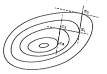
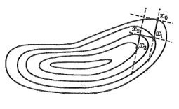
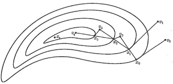
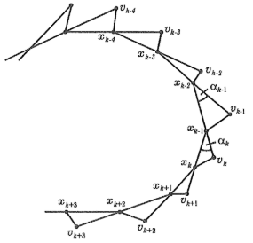
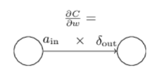

**ԳԼՈՒԽ** **1․ ՄԻ ՔԱՆԻ ՓՈՓՈԽԱԿԱՆԻ ՖՈՒՆԿՑԻԱՆԵՐԻ ՎԱՅՐԷՋՔԻ ՄԵԹՈԴՆԵՐ**

Օպտիմալացման խնդիրները, որոնք կապված են ֆունկցիաների մեծագույն և փոքրագույն արժեքների որոնման հետ, ունեն հնագույն պատմություն և այսօր առանցքային նշանակություն ունեն տնտեսագիտության, տեխնիկայի և կառավարման ոլորտներում,։ Մաթեմատիկական լեզվով այս խնդիրները ձևակերպվում են որպես որոշակի X բազմության վրա f(x) ֆունկցիայի էքստրեմումների որոնում։

Նախքան կոնկրետ մեթոդների նկարագրությանն անցնելը, կարևոր է նշել **մաքսիմումի որոշման ալգորիթմական կապը մինիմալացման հետ**. f(x) ֆունկցիայի մաքսիմալացման խնդիրը համարժեք է* -f(x)** ֆունկցիայի մինիմալացմանը նույն բազմության վրա։ Սա նշանակում է, որ fx→sup խնդիրը լուծելու համար կարելի է կիրառել մինիմալացման ցանկացած մեթոդ -f(x) ֆունկցիայի նկատմամբ, քանի որ ցանկացած մաքսիմալացնող հաջորդականություն համարվում է մինիմալացնող հաջորդականություն -f(x) -ի համար։

Մի քանի փոփոխականի ֆունկցիաների օպտիմալացման համար կիրառվում են մի շարք արդյունավետ իտերացիոն մեթոդներ, որոնցից յուրաքանչյուրն ունի իր առանձնահատկությունները.

- **Գրադիենտային վայրէջքի մեթոդը** հիմնված է այն փաստի վրա, որ հակագրադիենտի ուղղությունը հանդիսանում է ֆունկցիայի ամենաարագ նվազման ուղղությունը։
- **Կիրճերի մեթոդը** կիրառվում է գրադիենտային մեթոդի արդյունավետությունը բարձրացնելու համար, երբ ֆունկցիայի մակարդակի գծերը խիստ ձգված են («կիրճային» բնույթ), ինչը թույլ է տալիս խուսափել դանդաղեցնող զիգզագաձև շարժումներից և շարժվել կիրճի «հատակով»։
- **Կոորդինատային վայրէջքի մեթոդը** նախատեսված է այն դեպքերի համար, երբ մինիմալացվող ֆունկցիան չունի անհրաժեշտ հարթություն, կամ երբ ածանցյալների հաշվարկը չափազանց աշխատատար է։ Այս դեպքում մինիմալացումը  իրականացվում է միայն ֆունկցիայի արժեքների հաշվարկի վրա՝ ըստ առանձին կոորդինատների։
- **Ստոխաստիկ մեթոդները** կամ պատահական որոնման մեթոդները՝ որոնման ալգորիթմի մեջ ներմուծում են պատահականության տարրեր։ Սա հատկապես անհրաժեշտ է այնպիսի խնդիրների լուծման համար, որտեղ առկա են պատահական սխալներ կամ որոնք դասվում են ստոխաստիկ ծրագրավորման շարքին։

**1.1 ԳՐԱԴԻԵՆՏԱՅԻՆ ՎԱՅՐԷՋՔԻ ՄԵԹՈԴ**

Դիտարկենք հետևյալ խնդրը

fx→inf;     x∈X=En  (1)

ենթադրելով, որ fx ֆունկցիան անընդհատ դիֆերենցիալ է En-ում, այսինքն՝ fx∈C1(En)  : Դիֆերենցիալ ֆունկցիայի սահմանման համաձայն՝

fx+h-fx=f'x, h+oh;x,       (2)

որտեղlim|h|→0oh;xh-1=0: Եթե f'x≠0, ապա բավականաչափ փոքր h-ի դեպքում (2) աճը կորոշվի f'x, h մեծությամբ: Կոշի-Բունյակովսկու անհավասարության շնորհիվ․

-|f'x| \*|h|≤f'x, h≤|f'x| \*|h|

ավելին, եթե f'x≠0 է, ապա աջ անհավասարությունը դառնում է հավասարություն միայն h=αf'x-ի համար, իսկ ձախ անհավասարությունը՝ միայն h=-αf'x-ի համար, որտեղ α=const≥0: Այստեղից պարզ է դառնում, որ f'x≠0 -ի դեպքում x կետում fx ֆունկցիայի ամենաարագ աճի ուղղությունը համընկնում է f'x-ի գրադիենտի ուղղության հետ, իսկ ամենաարագ նվազման ուղղությունը համընկնում է հակագրադիենտի ուղղության հետ (-f'x):

Գրադիենտի այս ուշագրավ հատկությունն ընկած է ֆունկցիաների մինիմալացման մի շարք իտերացիոն մեթոդների հիմքում։ Այդպիսի մեթոդներից մեկը **գրադիենտային մեթոդն** է։ Այս մեթոդը, ինչպես բոլոր իտերացիոն մեթոդները, ենթադրում է սկզբնական մոտարկման՝ ինչ-որ x0 կետի ընտրություն։ Ցավոք, գրադիենտային մեթոդում (ինչպես և այլ մեթոդներում) x0 կետի ընտրության ընդհանուր կանոններ չկան։ Այն դեպքերում, երբ երկրաչափական, ֆիզիկական կամ այլ նկատառումներից ելնելով կարող է ստացվել տեղեկություն մինիմումի կետի (կամ կետերի) տեղակայման տիրույթի մասին, ապա x0 սկզբնական մոտարկումը ընտրվում է այդ տիրույթին հնարավորինս մոտ։

Ենթադրենք, որ ինչ-որ x0 սկզբնական կետ արդեն ընտրված է։ Այդ դեպքում գրադիենտային մեթոդը կայանում է {xk} հաջորդականության կառուցման մեջ՝ ըստ հետևյալ կանոնի.

xk+1=xk-αkf'xk,     αk>0,    k=0,1,…     (3)

բանաձևի αk թիվը հաճախ անվանում են **քայլի երկարություն** կամ պարզապես գրադիենտային մեթոդի **քայլ**։ Եթե f'x≠0, ապա αk>0 քայլը կարելի է ընտրել այնպես, որ fxk+1<fxk։ Իսկապես, (2) հավասարությունից ունենք.

fxk+1-fxk=αk-f'xk2+oαkαk-1<0

բոլոր բավականաչափ փոքր αk>0  դեպքում: Եթե f'x=0, ապա xk-ն **անշարժ կետ** է: Այս դեպքում (3) գործընթացը դադարեցվում է, և անհրաժեշտության դեպքում կատարվում է ֆունկցիայի վարքի լրացուցիչ հետազոտություն xk կետի շրջակայքում՝ պարզելու համար, թե արդյոք fx  ֆունկցիան այդ կետում հասնում է մինիմումի, թե ոչ: Մասնավորապես, եթե fx-ը ուռուցիկ ֆունկցիա է, ապա համաձայն հետևյալ թեորեմի անշարժ կետում միշտ հասնում է մինիմումի:

*Թեորեմ․* Ենթադրենք X-ը ուռուցիկ բազմություն է, իսկ X\*-ը՝ X բազմության վրա fx ֆունկցիայի մինիմումի կետերի բազմությունը։ Եթե x\*∈X\* կետում fx ֆունկցիան դիֆերենցելի է, ապա անհրաժեշտաբար տեղի ունի հետևյալ անհավասարությունը.

f'x\*,x-x\*≥0     ∀x∈X,    (3')

որը x\*∈int X դեպքում վերածվում է հավասարության.  f'x\*=0։ Եթե, բացի այդ, fx ֆունկցիան ուռուցիկ է X բազմության վրա, ապա (3') պայմանը բավարար է, որ x\*∈X\*։

`   `Գոյություն ունեն (3) մեթոդում αk մեծության ընտրության տարբեր եղանակներ: Կախված αk-ի ընտրության եղանակից՝ կարելի է ստանալ գրադիենտային մեթոդի տարբեր տարբերակներ: Նշենք գործնականում առավել կիրառելի αk-ի ընտրության մի քանի եղանակ.

\1) x=xk-αf'xk, α≥0 ճառագայթի վրա, որն ուղղված է հակագրադիենտի ուղղությամբ, ներմուծենք մեկ փոփոխականի ֆունկցիա՝

gkα=fxk-αf'xk,   α≥0  

և որոշենք αk-ն հետևյալ պայմանից՝

gkαk=infα≥0gkα=gk\*,    αk≥0    (4)

(3), (4) մեթոդն ընդունված է անվանել **ամենաարագ վայրէջքի մեթոդ** (method of steepest descent): Երբ f'xk≠0, համաձայն հետևյալ հավասարման՝

g't=f'x+th,h,   g''(t)=(f''(x+th)h,h)     0≤t≤1        (4')

` `ունենք gk'0=-f'xk2<0 հետևաբար ստորին (4)-ի սահմանին կարելի է հասնել միայն այն դեպքում, երբ αk>0: Բերենք օրինակ, որտեղ (4) պայմանով որոշված ​​αk մեծությունը գոյություն ունի և կարող է գրվել բացահայտորեն։

**Օրինակ 1.** Ենթադրենք տրված է քառակուսային ֆունկցիա՝

fx=12Ax,x-b,x,        (5)

որտեղ A-ն n×nկարգի սիմետրիկ դրական որոշյալ մատրից է, իսկ b -ն՝ վեկտոր En տարածությունից: Այս ֆունկցիան ուռուցիկ է, և նրա ածանցյալները հաշվարկվում են հետևյալ բանաձևերով՝

f'x=Ax-b,   f"(x)=A.

Ուստի, (3) մեթոդն այս դեպքում կունենա հետևյալ տեսքը՝

xk+1=xk-αkAxk-b,    k=0,1,…

Այսպիսով, (5) ֆունկցիայի համար գրադիենտային մեթոդն իրենից ներկայացնում է Ax=b գծային հանրահաշվական հավասարումների համակարգի լուծման հայտնի իտերացիոն մեթոդը: Որոշենք ​​αk-ն (4) պայմաններից: Օգտվելով fu+h-fu=Au-b,h+12(Ah,h) բանաձևից՝ ունենք.

gkα=fxk-αf'xk2+α22Af'xk,f'xk,   α≥0 

Երբ f'xk≠0, ապա gk'(α)=-f'xk2+αAf'xk,f'xk=0,    պայմանը տալիս է՝

αk=f'xk2(Af'xk,f'xk)=|Axk-b|2(AAxk-b,Axk-b)>0

Քանի որ gkα ֆունկցիան ուռուցիկ է, ապա գտնված αk կետում այս ֆունկցիան հասնում է իր ստորին եզրին (ինֆիմումին) α≥0  դեպքում: (5) ֆունկցիայի համար ամենաարագ վայրէջքի մեթոդը նկարագրված է:

Սակայն αk մեծության ճշգրիտ որոշումը (4) պայմաններից միշտ չէ, որ հնարավոր է: Բացի այդ, (4)-ում ստորին եզրը որոշ k արժեքների դեպքում կարող է և չհասնվել: Ուստի գործնականում սահմանափակվում են αk-ի այնպիսի արժեք գտնելով, որը մոտավորապես բավարարում է (4) պայմաններին: Այստեղ հնարավոր է, օրինակ, αk -ի ընտրություն հետևյալ պայմանից՝

gk\*≤gkαk≤ gk\*+δk,   δk≥0,  k=0∞δk=δ<∞,    (6)

կամ հետևյալ պայմանից՝

gk\*≤gkαk≤1-λkgk0+λkgk\*,   0<λ≤λk≤1,    (7)

(6) և (7) բանաձևերում δk, λk մեծությունները բնութագրում են (4) պայմանի կատարման սխալանքը. որքան δk-ն մոտ է զրոյին կամ λk-ն՝ մեկին, այնքան ավելի ճշգրիտ է կատարվում (4) պայմանը: (6), (7) պայմաններից αk-ն փնտրելիս կարելի է օգտվել մեկ փոփոխականի ֆունկցիաների մինիմալացման տարբեր մեթոդներից:

Հարկ է նաև նշել, որ (-f'xk)  հակագրադիենտը ցույց է տալիս ամենաարագ վայրէջքի ուղղությունը միայն αk կետի բավականաչափ փոքր շրջակայքում: Սա նշանակում է, որ եթե fx ֆունկցիան փոփոխվում է արագ, ապա հաջորդ xk+1 կետում (-f'xk+1) հակագրադիենտի ուղղությունը կարող է խիստ տարբերվել (-f'xk) ուղղությունից : Հետևաբար, (4) պայմաններից αk մեծության չափազանց ճշգրիտ որոշումը միշտ չէ, որ խորհուրդ է տրվում։

\2) Գործնականում հաճախ բավարար է այնպիսի αk>0 գտնել, որն ապահովում է մոնոտոնության պայմանը՝ fxk+1< fxk : Այդ նպատակով տրվում է որևէ հաստատուն α>0 և (3) մեթոդում յուրաքանչյուր իտերացիայի ժամանակ վերցնում են αk=α: Ընդ որում, յուրաքանչյուր k≥0-ի համար ստուգում են մոնոտոնության պայմանը, և դրա խախտման դեպքում αk=α-ն մասնատում են (կիսում են) այնքան ժամանակ, մինչև մեթոդի մոնոտոնությունը վերականգնվի: Ժամանակ առ ժամանակ օգտակար է փոխել α-ն փորձելով մեծացնել այն՝ պահպանելով մոնոտոնության պայմանը:

3)Եթե f(x)∈C1,1(En) ֆունկցիան է, այսինքն՝ f(x)∈C1(En)  և f'(x) գրադիենտը բավարարում է հետևյալ պայմանին.

f'u-f'v≤Lu-v,      u,v∈En,

ընդ որում L հաստատունը հայտնի է, ապա (3)-ում որպես αk կարող է վերցվել ցանկացած թիվ, որը բավարարում է հետևյալ պայմաններին.

0<ε0≤αk≤2L+2ε ,          (8)

որտեղ ε0, ε-ն մեթոդի պարամետրեր հանդիսացող դրական թվեր են: Մասնավորապես, երբ ε=L2, ε0=1L, կստանանք (3) մեթոդը հաստատուն քայլով՝ αk=1L: Այստեղից պարզ է, որ եթե L հաստատունը մեծ է կամ ստացվել է չափազանց կոպիտ գնահատականների միջոցով, ապա αk քայլը (3)-ում կլինի փոքր:

4)Հնարավոր է αk-ի ընտրություն հետևյալ պայմանից.

fxk-fxk-αkf'xk≥εαkf'xk2,   ε>0        (9)

(9) պայմանը բավարարելու համար սովորաբար սկզբում վերցնում են որոշակի αk=α>0 թիվ (նույնը բոլոր իտերացիաների համար, օրինակ՝ αk=1), իսկ հետո անհրաժեշտության դեպքում կիսում են այն, այսինքն՝ փոխում են αk=λiα, i=0,1,…,  0<λ<1 օրենքով, մինչև առաջին անգամ չկատարվի (9) պայմանը:

5)Հնարավոր է αk մեծությունների ապրիորի նշանակում հետևյալ պայմաններից.

αk>0,   k=0,1,…;   k=0∞αk=∞, k=0∞αk2<∞.     (10)

Օրինակ, որպես αk կարելի է վերցնել αk=c(k+1)-α, որտեղ c=const>0, իսկ α թիվն այնպիսին է, որ 12<α≤1: Մասնավորապես, եթե α=1, c=1, ապա կստանանք αk=(k+1)-1,  k=0,1,…: {αk}-ի այսպիսի ընտրությունը (3)-ում շատ պարզ է իրականացման համար, բայց չի երաշխավորում fxk+1<f(xk) մոնոտոնության պայմանի կատարումը և, ընդհանուր առմամբ, դանդաղ է զուգամիտում:

6)Այն դեպքերում, երբ նախապես հայտնի է f\*=infEn(x)>-∞ մեծությունը, (3)-ում կարելի է ընդունել.

αk=(fxk-f\*)|f'(xk)|-2

` `սա  f=f\* ուղղի հատման կետի աբսցիսն է f=gkα=f(xk-αf'(xk)) կորի շոշափողի հետ (0,gk0) կետում:

Ենթադրենք, որ (3) բանաձևում αk քայլի ընտրության որևէ եղանակ արդեն ընտրված է։ Այդ դեպքում գործնականում (3) իտերացիաները շարունակվում են այնքան ժամանակ, մինչև տեղի չունենա հաշվարկի ավարտի որևէ չափանիշ։ Այստեղ հաճախ օգտագործվում են հետևյալ չափանիշները.

- |xk-xk+1|≤ε կամ
- |f(xk)-f(xk+1)|≤ε, կամ
- f'(xk|≤ε, կամ
- |f(xk+1)-f(xk)||xk+1-xk|<ε, կամ
- |f(xk)-f(xk+1)|+|xk-xk+1|≤ε,

որտեղ ε>0 -ն տրված թիվ է (ճշտություն)։ Երբեմն նախապես սահմանվում է իտերացիաների քանակը. հնարավոր են նաև այս և այլ չափանիշների տարբեր համակցություններ։

Իհարկե, հաշվարկի ավարտի այս չափանիշներին պետք է վերաբերվել քննադատաբար, քանի որ դրանք կարող են տեղի ունենալ նաև որոնելի մինիմումի կետից հեռու։ Ցավոք, դեռևս չկան հաշվարկի ավարտի այնպիսի հուսալի չափանիշներ, որոնք կերաշխավորեին (1) խնդրի լուծումը պահանջվող ճշտությամբ և կիրառելի կլինեին խնդիրների լայն դասի համար։

Տեսական հարցերում, երբ հետազոտվում է մեթոդի զուգամիտությունը, ենթադրվում է, որ (3) գործընթացը շարունակվում է անսահմանափակ և հանգեցնում է {xk} հաջորդականությանը։ Այստեղ առաջանում են հարցեր՝ արդյո՞ք ստացված {xk}  հաջորդականությունը կլինի մինիմալացնող (1) խնդրի համար, արդյո՞ք այն կզուգամիտի մինիմումի կետերի բազմությանը՝

X\*={x∈En, fx=f\*=infEnf(x)

կամ, այլ կերպ ասած, տեղի ունե՞ն հետևյալ առնչությունները.

limk→∞fxk=f\*,    limk→∞ρxk,X\*=0.         (11)

Այս հարցերին դրական պատասխան տալու համար f(x) ֆունկցիայի վրա, բացի f(x)∈C1(En)   պայմանից, հարկ է լինում դնել լրացուցիչ՝ ավելի խիստ սահմանափակումներ։

**2.** Ավելի մանրամասն դիտարկենք այս հարցերը ամենաարագ վայրէջքի մեթոդի (steepest descent) համար, երբ (3)-ում αk մեծությունը ընտրվում է (6) պայմանից:

**Թեորեմ 1.** Դիցուք f\*=infEnf(x)>-∞ և f(x)∈C1,1(En) : Այդ դեպքում (3), (6) մեթոդով ստացված {xk}  հաջորդականությունը, կամայական x0 սկզբնական մոտարկման դեպքում, այնպիսին է, որ limk→∞f'xk=0: Եթե ընդ որում M0x0={ x∈En:fx≤fx0+δ} բազմությունը, որտեղ δ -ն վերցված է (6)-ից, սահմանափակ է, ապա limk→∞ρxk,S\*=0 , որտեղ S\*={x∈Mδx0:f'x=0} , fx ֆունկցիայի ստացիոնար կետերի բազմությունն է Mδx0-ի վրա:

**Թեորեմ 2.** Դիցուք կատարված են Թեորեմ 1-ի բոլոր պայմանները և, բացի այդ, fx ֆունկցիան ուռուցիկ  է En-ի վրա: Այդ դեպքում (3), (6) պայմաններով որոշվող {xk} հաջորդականության համար տեղի ունեն (11) առնչությունները: Եթե, բացի այդ, (6)-ում δk=O(k-2), ապա արդարացի է հետևյալ գնահատականը.

0≤fxk-f\*≤c0k-1,   c0=const>0,          (12)

**Թեորեմ 3.** Դիցուք f(x)∈C1,1(En) և fx -ը ուռուցիկ է En-ի վրա։ Այդ դեպքում (3), (6) մեթոդով ստացված {xk} հաջորդականության համար, կամայական x0 սկզբնական մոտարկման դեպքում, արդարացի են (11) առնչությունները։ Եթե ընդ որում δk=O(k-2), ապա տեղի ունի (12) գնահատականը։ Եթե δk=0, k=0,1,…, ապա ճիշտ է (12)-ից ավելի լավ գնահատական՝

0≤fxk-f\*≤fx0-f\*qk,         (13)

|xk-x\*|2≤2μfx0-f\*qk,     k=0,1,…,       (14) 

որտեղ x\*-ը fx  ֆունկցիայի մինիմումի կետն է En-ի վրա, q=1-μL,   0≤q<1  μ -ն հաստատուն է։

*Օրինակ․* Տրված է ϕ 2 փոփոխականի ֆունկցիա ϕx1,x2=4x12-3x1x2+5x22-3x1+5x2-2*  և պետք է որոշել այդ ֆունկցիայի մինիմումը ε=0.1 ճշտությամբ։

*Լուծում*․ Հաշվում ենք գրադիենտը՝

∇ϕx1,x2={8x1-3x2-3;-3x1+10x2+5}

Սկզբից վերցնում ենք  x0=(x10;x20)=0;0

Լուծումը իրականացնենք գրադիենտային վայրէջքի մեթոդով, հաշվում ենք x0 կետում գրադիենտը․

∇ϕx0=-3;5 քանի որ, ∇ϕx0=√34≮ε սկսում ենք գրադիենտային մեթոդի գործընթացը։

Վերցնենք φt=ϕ0-3t;0+5t=ϕ-3t;5t և հաշվում ենք՝

` `φ'(t)=ϕx1-3t;5t\*-3+ϕx2-3t;5t\*5=-3-24t-15t-3+59t+50t+5=412t+34=0  =>  t=-17206

x1=x11;x21=-3-17206;5\*-17206=51206;-85206

∇ϕx1=45206;27206=92065,3                 ∇ϕx1=9206√34=0.25≮ε  

` `φt=ϕx1+t\*∇ϕx1=ϕ51206+t\*9206\*5 ;-85206+t\*9206\*3=ϕ51206+5τ ;-85206+3τ=ϕa;b 

որտեղ նշանակել ենք՝    τ=t\*9206,   իսկ՝      a=51206+5τ,  b=-85206+3τ 

` `φ'τ=ϕx1a;b\*5+ϕx2a;b\*3=0

58a-3b-3+3-3a+10b+5=0

31a+15b=0  =>     3151206+5τ+15-85206+3τ=0      τ=-15320600

x2=51206-5\*15320600 ;-85206-3\*15320600 =8674120; -895920600

∇ϕx2=-24320600;814120=8120600-3;5       |∇ϕx2|=0.02<ε   =>

xmin≈x2=8674120; -895920600        ϕmin≈ ϕx2=-3.41

*Ամենաարագ վայրէջքի մեթոդն ունի պարզ երկրաչափական իմաստ*. պարզվում է, որ xk+1 կետը, որը որոշվում է (3), (4) պայմաններով, գտնվում է  Lk={x:x=xk-αf'xk,α≥0} ճառագայթի և Γk+1={x∈En:fx=f(xk+1)}  մակարդակի կորի շոշափման կետում, իսկ հենց Lk ճառագայթը ուղղահայաց է Γk={x∈En:fx=f(xk)} մակարդակի կորին։ (Նկ․1 ,Նկ. 2)

Իրոք, դիցուք x=xt, a≤t≤b-ն Γk-ին պատկանող կորի որոշակի պարամետրական հավասարումն է, այսինքն՝ fxt=fxk=const,  a≤t≤b, ընդ որում xt0=xk։ Այդ դեպքում ddtfxt=f'xt, xt=0,  a≤t≤b: Մասնավորապես, t=t0 դեպքում ունենք f'(xk),xt0=0 ։ Սա նշանակում է, որ f'(xk) գրադիենտը ուղղահայաց է xk կետում մակարդակի կորի շոշափող ուղղությանը, կամ Lk ճառագայթը ուղղահայաց է Γk-ին։ Հաջորդիվ, (4) պայմանից αk>0 դեպքում ստանում ենք gk'αk=-f'xk-αkf'xk, f'xk=-f'xk+1,f'xk=0։ Բայց քանի որ f'xk+1 վեկտորը ուղղահայաց է Γk+1-ին xk+1 կետում, ապա վերջին հավասարությունը նշանակում է, որ f'xk ուղղությունը և, հետևաբար, Lk ճառագայթը հանդիսանում են շոշափողներ Γk+1 կորի համար xk+1 կետում։

**3.** (Նկ․1 ,Նկ. 2) նկարներից կարելի է հասկանալ, որ որքան fx=const մակարդակի կորը մոտ է սֆերային (գնդին), այնքան ավելի լավ է զուգամիտում **ամենաարագ վայրէջքի մեթոդը**։ Նույն երևույթը կարելի է տեսնել նաև (13), (14) գնահատականներից. որքան μL հարաբերությունը մոտ է մեկին (իսկ fx=|x|2 ֆունկցիայի համար, որի մակարդակի մակերևույթները սֆերաներ են, երբ ունենք μL=1), այնքան q -ն մոտ է զրոյին և այնքան լավն է զուգամիտությունը։

(Նկ․1 ,Նկ. 2)  նկարները ցույց են տալիս, իսկ տեսական հետազոտություններն ու թվային փորձերը հաստատում են, որ ամենաարագ վայրէջքի մեթոդը և գրադիենտային մեթոդի այլ տարբերակները դանդաղ են զուգամիտում այն դեպքերում, երբ fx ֆունկցիայի մակարդակի կորերը խիստ ձգված են, և ֆունկցիան ունի այսպես կոչված **«կիրճային» (овражный)** բնույթ։

*Նկ. 1Նկ. 2* 

Սա նշանակում է, որ որոշ փոփոխականների չնչին փոփոխությունը հանգեցնում է ֆունկցիայի արժեքների կտրուկ փոփոխության. փոփոխականների այս խումբը բնութագրում է «կիրճի լանջը»։ Իսկ մյուս փոփոխականների ուղղությամբ, որոնք սահմանում են «կիրճի հատակի» ուղղությունը, ֆունկցիան փոփոխվում է աննշան (Նկ․2  և Նկ. 3 պատկերված են երկու փոփոխականի «կիրճային» ֆունկցիայի մակարդակի գծերը)։

*Նկ․ 3*

Եթե կետը գտնվում է «կիրճի լանջին», ապա այդ կետից վայրէջքի ուղղությունը կլինի գրեթե ուղղահայաց «կիրճի հատակի» ուղղությանը։ Արդյունքում, գրադիենտային մեթոդով ստացվող xk մոտարկումները հերթով կհայտնվեն մեկ «կիրճի մի լանջին», մեկ՝ մյուս։ Եթե «կիրճի լանջերը» բավականաչափ զառիթափ են, ապա xk կետերի նմանատիպ «լանջից լանջ» ցատկերը կարող են խիստ դանդաղեցնել գրադիենտային մեթոդի զուգամիտությունը։

Այս մեթոդի զուգամիտության  արագացման համար, «կիրճային» ֆունկցիայի մինիմումի որոնման ժամանակ, կարելի է առաջարկել հետևյալ էվրիստիկական հնարքը, որը կոչվում է **կիրճերի մեթոդ**: Սկզբում նկարագրենք այս մեթոդի պարզագույն տարբերակը: Որոնման սկզբում տրվում են երկու կետեր՝ v0,* v1 որոնցից կատարվում է վայրէջք՝ օգտագործելով գրադիենտային մեթոդի որևէ տարբերակ, և ստացվում են երկու կետեր՝ x0,* x1 «կիրճի հատակին»: Այնուհետև ընդունում են՝

v2= x1- x1- x0x1- x0-1h sign(f(x1)- f(x0)),

որտեղ h -ը դրական հաստատուն է, որը կոչվում է **կիրճի քայլ**: v2 կետից, որը, գտնվում է «կիրճի լանջին», կատարում են վայրէջք գրադիենտային մեթոդի օգնությամբ և որոշում են հաջորդ x2 կետը «կիրճի հատակին»:

Եթե արդեն հայտնի են x0,* x1,…,xk,* կետերը, k≥2, ապա՝

vk+1= xk- xk- xk-1xk- xk-1-1h sign(f(xk)- f(xk-1)),    (15)

կատարում են գրադիենտային մեթոդով վայրէջք և գտնում են հաջորդ xk+1 կետը «կիրճի հատակին» (նկ. 3; վայրէջքը vk կետից դեպի xk կետը, որը հնարավոր է բաղկացած է գրադիենտային մեթոդի մի քանի իտերացիոն քայլերից, պայմանականորեն պատկերված է vk,* xk ,* k=0.1,…  կետերը միացնող ուղիղ գծի հատվածով):

h կիրճի քայլի մեծությունն ընտրվում է էմպիրիկ կերպով՝ հաշվի առնելով նվազագույնի հասցվող (մինիմիզացվող) ֆունկցիայի մասին տեղեկատվությունը, որը ստացվում է մինիմումի որոնման ընթացքում: h -ի ճիշտ ընտրությունից էապես կախված է մեթոդի զուգամիտության արագությունը: Եթե h քայլը մեծ է, ապա «կիրճի» կտրուկ շրջադարձերի ժամանակ vk կետերը կարող են չափազանց հեռանալ «կիրճի հատակից», և վայրէջքը vk կետից դեպի xk կետ կարող է պահանջել հաշվարկների մեծ ծավալ: Բացի այդ, մեծ h -երի դեպքում կտրուկ շրջադարձերում կարող է vk կետը դուրս գալ «կիրճից», և մինիմումի կետի որոնման ճիշտ ուղղությունը կկորչի: Եթե h քայլը չափազանց փոքր է, ապա որոնումը կարող է խիստ դանդաղել, և կիրճերի մեթոդի կիրառման արդյունքը կարող է դառնալ աննշան:

Կիրճերի մեթոդի արդյունավետությունը կարող է էապես աճել, եթե կիրճի քայլի մեծությունն ընտրվի փոփոխական՝ արձագանքելով «կիրճի» շրջադարձերին, որպեսզի.

1. Հնարավորինս արագ անցնեն «կիրճի հատակի» ուղղագիծ հատվածները՝ կիրճի քայլի մեծացման հաշվին:
1. «Կիրճի» կտրուկ շրջադարձերին խուսափեն կիրճից «դուրս գալուց»՝ կիրճի քայլի փոքրացման հաշվին:
1. Հասնեն vk կետերի հնարավորինս փոքր շեղմանը «կիրճի հատակից» և դրանով իսկ կրճատեն հաշվարկների ծավալը, որն անհրաժեշտ է vk կետից դեպի xk  կետ (k=0.1,…  ) գրադիենտային վայրէջքի համար:

Ինտուիտիվ պարզ է, որ «կիրճի» շրջադարձին ճիշտ արձագանքելու համար պետք է հաշվի առնել «կիրճի հատակի կորությունը»։

Դիտարկենք կիրճի քայլի ընտրության հետևյալ եղանակը.

hk+1=hk\*ccosαk-cosαk-1,   k=2,3,….,       (16)

որտեղ αk-ն vk-xk-1 և xk-xk-1 վեկտորների միջև ընկած անկյունն է, որը որոշվում է հետևյալ պայմանով.

cosαk=(vk-xk-1,xk-xk-1)|vk-xk-1|-1|xk-xk-1|-1

իսկ c>1 հաստատունը հանդիսանում է ալգորիթմի պարամետր: vk+1 կետը որոշվում է (15) բանաձևից՝ h=hk+1 դեպքում: cosαk-cosαk-1 տարբերությունը (16) հավասարության մեջ կապված է «կիրճի հատակի կորության» հետ և, բացի այդ, օժտված է «կորության» փոփոխման ուղղությունը նշելու կարևոր հատկությամբ: Այսինքն, «կիրճի հատակի» փոքր «կորությամբ» տեղամասերից մեծ «կորությամբ» տեղամասերի անցնելիս կունենանք cosαk-cosαk-1<0 (նկ. 4): Քանի որ տեզի ունի (15)-ը, ունենք hk+1<hk, այսինքն՝ կիրճի քայլը փոքրանում է՝ հարմարվելով «կիրճի հատակի» շրջադարձին, ինչն իր հերթին հանգեցնում է vk+1  կետի՝ դեպի «կիրճի լանջերից» շեղման նվազմանը:

*Նկ. 4*

«Կիրճի հատակի» մեծ «կորությամբ» տեղամասերից դեպի փոքր «կորությամբ» տեղամասեր անցնելիս, ընդհակառակը, cosαk-cosαk-1>0, հետևաբար կիրճի քայլը կմեծանա և հնարավորություն կստեղծվի համեմատաբար արագ անցնել փոքր «կորությամբ» տեղամասերը, մասնավորապես՝ «կիրճի հատակի» ուղղագիծ տեղամասերը:

Եթե «կիրճի հատակի կորությունը» որոշ տեղամասերում մնում է հաստատուն, ապա cosαk-cosαk-1 տարբերությունը մոտ կլինի զրոյին, և նման տեղամասերում մինիմումի որոնումը կիրականացվի գրեթե հաստատուն քայլով, որը ձևավորվել է՝ հաշվի առնելով դիտարկվող տեղամաս դուրս գալու պահին եղած «կորության» մեծությունը:

(16) հավասարման մեջ c պարամետրը կարգավորում է մեթոդի «զգայունությունը» «կիրճի հատակի կորության» փոփոխության նկատմամբ, և այս պարամետրի ճիշտ ընտրությունը մեծապես որոշում է «կիրճով» շարժման արագությունը: Կիրճի քայլի համար (16) արտահայտությունը հարմար է ձևափոխել այսպես.

hk+1=hk\*ccosαk-cosαk-1=hk-1\*ccosαk-cosαk-2=…=h2\*ccosαk-cosα1

որտեղից ունենք.

hk+1=Accosαk,     A=h2c-cosα1=const>0, k=2,3,…

*Օրինակ․* Տրված է ϕ 2 փոփոխականի ֆունկցիա ϕx1,x2=3x12-2x1x2+4x22-2x1+x2*  և պետք է որոշել այդ ֆունկցիայի մինիմումը ε=0.1 ճշտությամբ։

*Լուծում*․ Հաշվում ենք գրադիենտը՝

∇ϕx1,x2={6x1-2x2-2;-2x1+8x2+1}

Սկզբից վերցնում ենք  x0=(x10;x20)=0;0

Լուծումը իրականացնենք գրադիենտային վայրէջքի մեթոդով, հաշվում ենք x0 կետում գրադիենտը․

∇ϕx0=-2;1 քանի որ, ∇ϕx0=√5≮ε սկսում ենք գրադիենտային մեթոդի գործընթացը։

Վերցնենք φt=ϕ0-2t;0+t=ϕ-2t;t և հաշվում ենք՝

` `φ'(t)=ϕx1-2t;t\*-2+ϕx2-2t;t\*1=-2-12t-2t-2+4t+8t+1=40t+5=0  =>  t=-18

x1=x11;x21=-2-18;-18=14;-18

∇ϕx1=-14;-12 =14-1,-2                 ∇ϕx1=0.56≮ε  

` `φt=ϕx1+t\*∇ϕx1=ϕ14+t\*14\*(-1) ;-18+t\*14\*(-2)=ϕ14-τ ;-18-2τ=ϕa;b 

որտեղ նշանակել ենք՝    τ=t\*14,   իսկ՝      a=14-τ ,  b=-18-2τ 

` `φ'τ=ϕx1a;b\*-1+ϕx2a;b\*-2=0

-6a-2b-2-2-2a+8b+1=0

a+7b=0  =>    14-τ+7-18-2τ=0      τ=-124

x2=14+-124\*-1;-18+-124\*-2=724; -124

∇ϕx2=-16;112=112-2;1       |∇ϕx2|=0.19≮ε=>

Կիրառենք կիրճերի մեթոդը, վերցնելով՝ A=x0+x12,  B=x1+x22

A=0+142;0-182=18;-116         B=14+7242;-18-1242=1348;-112

AB=1348-18; -112+116=748; -148=1487;-1         c=7;-1  

φt=ϕx2+t\*c=ϕ724+7t ;-124-t=ϕa;b 

որտեղ նշանակել ենք՝   ՝      a=724+7t ,  b=-124-t 

` `φ'τ=ϕx1a;b\*7+ϕx2a;b\*-1=0

76a-2b-2--2a+8b+1=0

44a-22b-15=0  =>    44724+7t-22-124-t-15=0      t=1264

x3=(x2+tc)=724+7\*1264;-124-1264=722; -15328

∇ϕx2=11804;-1451=118041;-4       ∇ϕx3=0.002<ε=>

xmin≈x3=722; -15328       ϕmin≈ ϕx3=-0.341

**1.2 ԿՈՈՐԴԻՆԱՏԱՅԻՆ ՎԱՅՐԷՋՔԻ ՄԵԹՈԴ**

Որոշ մեթոդներ իրենց իրականացման համար պահանջում են մինիմալացվող ֆունկցիայի առաջին կամ երկրորդ կարգի ածանցյալների հաշվարկ: Սակայն գործնականում հաճախ են հանդիպում դեպքեր, երբ մինիմալացվող ֆունկցիան չունի անհրաժեշտ հարթություն, կամ երբ նրա ածանցյալների հաշվարկը չափազանց աշխատատար է և պահանջում է մեծ մեքենայական ռեսուրսներ: Նման իրավիճակներում նպատակահարմար է կիրառել այնպիսի մեթոդներ, որոնք հիմնված են միայն ֆունկցիայի արժեքների հաշվարկի վրա: Այդպիսի մեթոդներից է կոորդինատային վայրէջքի մեթոդը:

Դիտարկենք հետևյալ խնդրը

fx→inf;     x∈X=En  (1)

Ենթադրենք ei=(0,…,0,1,0,…,0)-ը միավոր կոորդինատային վեկտոր է, որի i-րդ կոորդինատը հավասար է 1-ի, մյուսները՝ զրոյի  (i = 1,..., n): Ենթադրենք x0-ն որոշակի սկզբնական մոտավորություն է, իսկ α0-ն՝ որոշակի դրական թիվ, որը քայլի չափը որոշող պարամետր է: Ենթադրենք, որ արդեն գիտենք x∈En կետը և αk > 0 թիվը որոշակի  k≥0-ի դեպքում: Ենթադրենք

pk=eik,  ik=k-nkn+1,     (2) 

որտեղ kn նշանակում է k\n թվի ամբողջ մասը: Պայման (2)-ը ապահովում է e1, e2, …, en կոորդինատային վեկտորների ցիկլիկ որոնում, այսինքն՝

p0=e1,…, pn-1=en, pn=e1, …,p2n-1=en, p2n=e1, …

Հաշվարկենք f(x) ֆունկցիայի արժեքը x=xk+αkpk կետում և ստուգենք հետևյալ անհավասարությունը։ 

fxk+αkpk<fxk     (3)

Եթե ​​(3) պայմանը բավարարում է, ապա ընդունում ենք

xk+1 =xk+αkpk ,  αk+1=αk   (4) 

Եթե ​​(3) պայմանը չի բավարարում, հաշվարկում ենք f(x) ֆունկցիայի արժեքը

` `x=xk-αkpk կետում և ստուգում ենք հետևյալ անհավասարությունը։ 

fxk-αkpk<fxk   (5)

Եթե ​​(5) պայմանը բավարարում է, սահմանում ենք

xk+1 =xk-αkpk ,  αk+1=αk   (6) 

(k+1)-րդ իտերացիան անվանում ենք հաջողված, եթե (3) կամ (5) անհավասարություններից առնվազն մեկը ճիշտ է։ Եթե (k+1)-րդ իտերացիան անհաջող է, այսինքն՝  և՛ (3) և՛ (5) անհավասարությունները չեն բավարարում, ապա ենթադրում ենք`

xk+1 =xk,   αk+1=λαk,  ik=n,  xk =xk-n+1, αk,       ik≠n,  xk ≠xk-n+1,    կամ,0≤k≤n-1     (7)

Այստեղ λ , 0<* λ <1 -ը ֆիքսված  թիվ է, որը քայլի չափը որոշող պարամետր է։  (7) պայմանը նշանակում է, որ եթե բոլոր e1, e2, …, en կոորդինատային ուղղությունների վերանայման n իտերացիաներից բաղկացած մեկ ցիկլի ընթացքում αk քայլով իրականացվել է թեկուզ մեկ հաջող իտերացիա, ապա քայլի երկարությունը αk չի բաժանվում և պահպանվում է առնվազն հաջորդ n իտերացիաներից բաղկացած ցիկլի ընթացքում:

Իսկ եթե վերջին n իտերացիաների մեջ չի գտնվել ոչ մի հաջող իտերացիա, ապա αk քայլը մասնատվում (փոքրացվում ) է: Այսպիսով, եթե k=km համարի իտերացիայի ժամանակ տեղի է ունեցել αk-ի բաժանում, ապա

fxkm+αkmei≥fxkm,  fxkm-αkmei≥fxkm     (8)

բոլոր i=1,…,n-ի համար։ Նկարագրվում է (1) խնդրի կոորդինատային վայրէջքի մեթոդը։ 

Քանի որ կոորդինատային վայրէջքի մեթոդը իտերացիոն գործընթաց է, անհրաժեշտ է սահմանել կանգի պայմաններ, որոնք թույլ կտան դադարեցնել հաշվարկները ցանկալի ճշտությանը հասնելու դեպքում։ Գործնականում կիրառվում են հետևյալ չափանիշները.

1. **Ըստ քայլի փոքրության.** Հաշվի առնելով, որ յուրաքանչյուր անհաջող ցիկլից հետո քայլը մասնատվում է (αk+1=λαk ) որպես կանգի պայման ընդունվում է քայլի երկարության նվազումը նախապես տրված ε > 0 թվից. 

αk≤ε

Սա նշանակում է, որ ֆունկցիայի հետագա մինիմալացումը տվյալ ճշտության սահմաններում հնարավոր չէ ։

1. **Ըստ ֆունկցիայի արժեքի փոփոխության.** Իտերացիաները դադարեցվում են, եթե երկու հաջորդական լրիվ ցիկլերի արդյունքում ֆունկցիայի արժեքի նվազումը դառնում է աննշան.

fxk+n-f(xk)≤ε

1. **Ըստ իտերացիաների քանակի.** Սահմանվում է առավելագույն թույլատրելի իտերացիաների քանակ Kmax, որը կանխում է ալգորիթմի անվերջ աշխատանքը այն դեպքերում, երբ զուգամիտությունը չափազանց դանդաղ է։

Գոյություն ունեն կոորդինատային վայրէջքի այլ տարբերակներ ևս: Օրինակ՝ քայլի չափը (αk) կարող է որոշվել ոչ թե ֆիքսված կանոնով, այլ յուրաքանչյուր կոորդինատային ուղղությամբ ֆունկցիայի միաչափ մինիմալացման միջոցով. 

xk+1 =xk+αkpk ,  αk=argminf(xk+αpk )   (9)

Սա հատկապես արդյունավետ է քառակուսային ֆունկցիաների դեպքում և հայտնի է որպես Գաուս-Զեյդելի մեթոդի անալոգ:

*Օրինակ․* Տրված է ϕ 2 փոփոխականի ֆունկցիա ϕx1,x2=5x12-4x1x2+5x22-x1-x2*  և պետք է որոշել այդ ֆունկցիայի մինիմումը ε=0.1 ճշտությամբ։

*Լուծում*․ Հաշվում ենք գրադիենտը՝

∇ϕx1,x2={10x1-4x2-1;-4x1+10x2-1}

Սկզբից վերցնում ենք  x0=(x10;x20)=1;0

Լուծումը իրականացնենք կոորդինատական վայրէջքի մեթոդով, հաշվում ենք x0 կետում գրադիենտը․

∇ϕx0=9;-5 քանի որ, ∇ϕx0=√106≮ε սկսում ենք վայրէջքի մեթոդի գործընթացը։

Վերցնենք φt=ϕt;x20=ϕt;0 և հաշվում ենք՝

` `φ'(t)=ϕx1t;0=10t-1=0  =>  t=110

x=(110;0)

∇ϕx=0;-75    ||∇ϕx||≮ε  

φt=ϕx10;t=ϕ110 ;t

`  `φ't=ϕx2110 ;t=-25+10t-1 =0  =>  t=750 

x1=110 ;750 

∇ϕx1=-1425;0  ||∇ϕx1||≮ε

φt=ϕt;x21=ϕt; 750 

` `φ't=ϕx1t; 750 =10t-1425-1 =0  =>  t=39250 

x=(39250;750)

∇ϕx=0;-28125    ||∇ϕx||≮ε  

φt=ϕx11;t=ϕ39250 ;t 

` `φ't=ϕx239250 ;t=-78125+10t-1 =0  =>  t=2031250 

x2=39250 ;2031250 

∇ϕx2=-56625;0  |∇ϕx2|=0.0896<ε =>

xmin≈x2=39250 ;2031250        ϕmin≈ ϕx2=-0.166189

**1.3 ՍՏՈԽԱՍՏԻԿ ՄԵԹՈԴ**

Փոփոխականների ֆունկցիաների մինիմալացման վերը նկարագրված մեթոդների հետ մեկտեղ գոյություն ունի մինիմումի որոնման մեթոդների մի մեծ խումբ, որոնք միավորված են **պատահական որոնման մեթոդ** անվան տակ։ Պատահական որոնման մեթոդի շատ տարբերակներ հանգում են xk   հաջորդականության կառուցմանը՝ ըստ հետևյալ կանոնի.

xk+1=xk+αkξ,      k=0,1,….          1

որտեղ xk-ն ինչ-որ դրական մեծություն է, իսկ ξ=(ξ1,…, ξn) -ն՝ հայտնի բաշխման օրենքով n-չափանի ξ պատահական մեծության որևէ իրացում։ Օրինակ՝ ξ պատահական վեկտորի ξ1 կոորդինատները կարող են լինել [-1, 1] հատվածում հավասարաչափ բաշխված անկախ պատահական մեծություններ։

n փոփոխականի ֆունկցիայի մինիմումի պատահական որոնման մեթոդը ենթադրում է պատահական թվերի գեներատորի առկայություն, որին դիմելով՝ ցանկացած անհրաժեշտ պահի կարելի է ստանալ տրված բաշխման օրենքով n -չափանի ξ պատահական վեկտորի որևէ իրացում։

**1. Մինիմումի որոնման ալգորիթմներ**

Բերենք X⊆ En բազմության վրա f(x) ֆունկցիայի մինիմումի պատահական որոնման մեթոդի մի քանի տարբերակ՝ ենթադրելով, որ k -րդ մոտարկումը՝ xk∈X;k≥0, արդեն հայտնի է։

**ա) Անհաջող քայլի դեպքում վերադարձով ալգորիթմ**

Այս ալգորիթմի իմաստը հետևյալն է. պատահական վեկտորի տվիչի օգնությամբ ստանում են դրա որևէ ξ իրացումը և En  տարածության մեջ որոշում են հետևյալ կետը.

vk=xk+αξ,  α=const>0

- Եթե vk∈X և fvk<f(xk), ապա կատարված քայլը համարվում է **հաջողված**, և այդ դեպքում ընդունվում է xk+1=vk:
- Եթե vk∈X, բայց fvk≥f(xk), կամ եթե vk∉X, ապա կատարված քայլը համարվում է **անհաջող**, և ընդունվում է xk+1=xk:

Եթե բավականաչափ մեծ  N թվի համար պարզվի, որ xk=xk+1=…=xk+N, ապա xk կետը ընդունվում է որպես որոնվող մինիմումի կետի մոտարկում:

**բ) Լավագույն փորձի ալգորիթմ (Алгоритм наилучшей пробы):**

Վերցվում են ξ պատահական վեկտորի որևէ s իրացումներ՝  ξ1,…,  ξs, և հաշվարկվում են f(x) ֆունկցիայի արժեքները x=xk+αξ,   i=1,…,s այն կետերում, որոնք պատկանում են X բազմությանը: Այնուհետև ընդունվում է xk+1=xk+αξi0, որտեղ i0 ինդեքսը որոշվում է հետևյալ պայմանից.

fxk+αξi0=minxk+αξi∈Xf(xk+αξi),    1≤i≤s

s>1 և*  α=const>0 մեծությունները հանդիսանում են ալգորիթմի պարամետրեր:

**գ) Վիճակագրական գրադիենտի ալգորիթմ**

Վերցվում են ξ պատահական վեկտորի որևէ s իրացումներ՝  ξ1,…,  ξs, և հաշվարկվում են տարբերությունները՝

∆fki=fxk+γξi-f(xk)

բոլոր այն դեպքերի համար, երբ xk+γξi∈X: Այնուհետև ընդունում են՝

pk=1γiξi∆fki ,

որտեղ գումարը կատարվում է բոլոր այն i -երի համար (1≤i≤s), որոնց դեպքում xk+γξi∈X:

Եթե xk+αpk∈X, ապա ընդունվում է xk+1=xk+αpk: Իսկ եթե xk+αpk∉X, ապա կրկնում են նկարագրված գործընթացը ξ պատահական վեկտորի նոր s իրացումների հավաքածուով: s>1, α>0,  γ>0 մեծությունները հանդիսանում են ալգորիթմի պարամետրեր: pk վեկտորն անվանում են **վիճակագրական գրադիենտ**:

Եթե X≡En, s=n, և ξi վեկտորները պատահական չեն ու համընկնում են համապատասխան ei=0,…,0,1,0,…,0, i=1,...,n, միավոր վեկտորների հետ, ապա նկարագրված ալգորիթմը, վերածվում է գրադիենտային մեթոդի տարբերակային (difference) անալոգի:

**2. Պատահական որոնում ուսուցմամբ**

Պատահական որոնման մեթոդի նկարագրված ա)–գ) տարբերակներում ենթադրվում է, որ ξ պատահական վեկտորի բաշխման օրենքը կախված չէ իտերացիայի (քայլի) համարից: Այդպիսի որոնումն անվանում են **պատահական որոնում առանց ուսուցման**:

Պատահական որոնման առանց ուսուցման ալգորիթմները օժտված չեն նախորդ իտերացիաների արդյունքները վերլուծելու և նվազագույնի հասցվող ֆունկցիայի նվազման իմաստով ավելի հեռանկարային ուղղություններ առանձնացնելու «ունակությամբ» և զուգամիտվում  են դանդաղ:

Միևնույն ժամանակ պատահական որոնման մեթոդից կարելի է ակնկալել մեծ արդյունավետություն, եթե յուրաքանչյուր իտերացիայի ժամանակ հաշվի առնվի նախորդ իտերացիաներում նվազագույնի որոնման կուտակված փորձը և վերակառուցվեն որոնման հավանականային հատկությունները այնպես, որ ξ ուղղությունները, որոնք ֆունկցիայի նվազման առումով ավելի հեռանկարային են, դառնան ավելի հավանական: Այլ կերպ ասած, ցանկալի է ունենալ պատահական որոնման ալգորիթմներ, որոնք օժտված են ինքնաուսուցման և ինքնակատարելագործման ունակությամբ՝ որոնման գործընթացում նվազագույնի հասնելու համար՝ կախված մինիմալացվող ֆունկցիայի կոնկրետ առանձնահատկություններից: Նման որոնումն անվանում են **ուսուցմամբ պատահական որոնում**:

Ալգորիթմի ուսուցումն իրականացվում է ξ պատահական վեկտորի բաշխման օրենքի նպատակաուղղված փոփոխության միջոցով՝ կախված իտերացիայի համարից և նախորդ իտերացիաների արդյունքներից այնպես, որ «լավ» ուղղությունները, որոնցով ֆունկցիան նվազում է, դառնան ավելի հավանական, իսկ մյուս ուղղությունները՝ պակաս հավանական: Այսպիսով, ուսուցմամբ պատահական որոնման մեթոդի տարբեր փուլերում հարկ է լինում գործ ունենալ տարբեր բաշխման օրենքներով ξ պատահական վեկտորների իրացումների հետ: Հաշվի առնելով այս հանգամանքը՝ (1) իտերացիոն գործընթացն ավելի հարմար է գրել հետևյալ տեսքով.

xk+1=xk+αkξk,      k=0,1,….          2

ընդգծելով ξ պատահական վեկտորի կախվածությունը k –ից:

Որոնման սկզբում ξ=ξ0 պատահական վեկտորի բաշխման օրենքն ընտրվում է՝ հաշվի առնելով մինիմալացվող ֆունկցիայի մասին առկա ապրիորի (նախնական) տեղեկատվությունը: Եթե նման տեղեկատվություն չկա, ապա որոնումը սովորաբար սկսում են այնպիսի ξ0=ξ01,…,ξ0n, պատահական վեկտորից ξ0i, i=1,…,n , որի բաղադրիչները հանդիսանում են [-1, 1] հատվածում հավասարաչափ բաշխված անկախ պատահական մեծություններ:

Ալգորիթմի ուսուցման համար որոնման գործընթացում հաճախ վերցնում են ξ=ξω պատահական վեկտորների ընտանիք, որոնք կախված են ω=(ω1,…,ωn) պարամետրերից, և k-րդ իտերացիայից (k+1)-րդ իտերացիային անցնելիս ωk պարամետրերի առկա արժեքները փոխարինվում են նոր ωk+1 արժեքներով՝ հաշվի առնելով նախորդ որոնման արդյունքները:

Ուսուցմամբ պատահական որոնումը որոշակի իմաստով միջանկյալ դիրք է զբաղեցնում առանց ուսուցման պատահական որոնման և նախորդ նկարագրված նվազագույնի որոնման մեթոդների միջև։ Իհարկե, նախորդ պարագրաֆների մեթոդներում նույնպես կարելի է այս կամ այն տեսքով հայտնաբերել ալգորիթմի ինքնաուսուցման տարրեր, սակայն պատահական գործոնի առկայությունը ալգորիթմում պատահական որոնման մեթոդը դարձնում է **ավելի ճկուն**։

**3.** Բազմափոփոխական ֆունկցիաների մինիմալացման խնդրի լուծումը զգալիորեն բարդացնում է **խոտանների (աղմուկի)** առկայությունը, երբ յուրաքանչյուր x կետում f(x) ֆունկցիայի արժեքների վրա դրվում են պատահական սխալներ։

Պատահական սխալների առկայության դեպքում ֆունկցիաների մինիմալացման խնդիրը դասվում է **ստոխաստիկ ծրագրավորման** խնդիրների շարքին։ 

**ԳԼՈՒԽ 2. ՀԵՏԱԴԱՐՁ ՏԱՐԱԾՄԱՆ ԱԼԳՈՐԻԹՄԸ ԵՎ ՆԵՅՐՈՆԱՅԻՆ ՑԱՆՑԵՐԻ ՄԱԹԵՄԱՏԻԿԱԿԱՆ ՀԻՄՔԵՐԸ**

**2.1. Հետադարձ տարածման դերը նեյրոնային ցանցերի ուսուցման մեջ**

Հետադարձ տարածման հիմքում ընկած է C կորստի ֆունկցիայի՝ նեյրոնային ցանցերի ω կշիռների (կամ b շեղումների) նկատմամբ մասնակի ածանցյալի ∂C/∂ω  արտահայտությունը։ Այն ցույց է տալիս, թե ինչ «արագությամբ» է կորուստը փոփոխվում՝ կախված կշիռների և շեղումների փոփոխությունից։ Հետադարձ տարածումը միայն արագագործ ալգորիթմ չէ, որը «ստիպված» ենք սովորել։ Իրականում այն տալիս է խորը ներըմբռնում այն մասին, թե ինչպես է կշիռների և շեղումների փոփոխությունն ազդում ցանցի վարքագծի վրա։ 

**2.2. Մաթեմատիկական նշանակումներ և մատրիցային մոտեցում**

Ցանցի կշիռներին տանք նշանակումներ։ Նշանակենք ωjkl-ով ցանցի (l-1)-րդ շերտի k-րդ նեյրոնը l-րդ շերտի j-րդ նեյրոնին միացնող կապի կշիռը։ Այսպիսով, օրինակ, ներքևի դիագրամում պատկերված կշիռը երկրորդ շերտի չորրորդ նեյրոնը միացնում է երրորդ շերտի երկրորդ նեյրոնի հետ.

Նմանատիպ նշանակումներ են օգտագործվում նաև ցանցի շեղումների և ակտիվացիաների համար։ Եվ այսպես, l-րդ շերտի j-րդ նեյրոնին համապատասխանող շեղումը կնշանակենք bjl-ով։ Ստորև ներկայացված դիագրամը ցույց է տալիս, թե ինչպես օգտագործել այս նշանակումները.

Ըստ այս նշանակումների, l-րդ շերտի j-րդ նեյրոնի ajl ակտիվացիան (l-1)-րդ շերտի նեյրոնների ակտիվացիաների հետ կապված է հետևյալ հավասարմամբ.

ajl=σkωjklakl-1+bjl,      1

որտեղ գումարն ըստ (l-1)-րդ շերտի  k նեյրոնների է։ Սահմանենք ωl *կշիռների մատրիցը (weight matrix)*: ωl  կշիռների մատրիցը կազմված է l-րդ շերտին կապվող նեյրոնների կշիռներից, այսինքն, j -րդ տողի k-րդ սյունակի էլեմենտը ωjkl կշիռն է։ Նույն ձևով, յուրաքանչյուր l շերտի համար սահմանենք bl *շեղման վեկտոր (bias vector)*։ Շեղման վեկտորի անդամները պարզապես bjl արժեքներն են՝ l-րդ շերտի նեյրոնների շեղումները։ Եվ վերջապես, սահմանենք al  ակտիվացիայի վեկտորը, որի անդամներն ajl  ակտիվացիաներն են։

(1) հավասարումն գրենք մատրիցային տեսքով։ Մեր նպատակն է, որպեսի σ-ն կարողանանք կիրառել v վեկտորի բոլոր էլեմենտների վրա։ Ֆունկցիայի էլեմենտ-առ-էլեմենտ կիրառումը նշանակենք σ(v) արտահայտությամբ։  σ(v)-ի տարրերը պարզապես σ(v)j=σ(vj) էլեմենտներն են։ Որպես օրինակ, դիտարկենք այն դեպքը, երբ ունենք fx=x2 ֆունկցիան, ապա ֆունկցիայի վեկտորացված տեսքը կլինի՝

f23=f2f3=49,

այսինքն վեկտորացված f-ն ուղղակի վեկտորի յուրաքանչյուր անդամը քառակուսի է բարձրացնում։

Հաշվի առնելով այս բոլոր նշանակումները, (1) հավասարումը կարելի է գրել այսպիսի կոմպակտ վեկտորացված տեսքով.

al=σkωlal-1+bl,         (2)

Այս արտահայտությունը ընդհանուր առմամբ հնարավորություն է տալիս դիտարկել նախորդ շերտի ակտիվացիաների ազդեցությունը հաջորդ շերտի ակտիվացիաների վրա. ուղղակի կիրառում ենք կշիռների մատրիցը ակտիվացիաների վրա, այնուհետև ավելացնում ենք շեղման վեկտորը և վերջապես կիրառում σ ֆունկցիան :

Երբ (2) հավասարումն օգտագործում ենք al-ը հաշվելու նպատակով, ապա հաշվում ենք նաև միջանկյալ`zl≡ωlal-1+bl արժեքը։ Այդ մեծությունը նշանակենք որպես zl ՝ l-րդ   *կշռված մուտքեր (weighted input)*։

**2.3. Ենթադրություններ կորստի ֆունկցիայի վերաբերյալ**

Հետադարձ տարածման նպատակն է հաշվել C կորստի ֆունկցիայի ∂C/∂ω և ∂C/∂b մասնակի ածանցյալները ω կշիռների և  b շեղումների նկատմամբ։ Կատարենք երկու ենթադրություններ հետադարձ տարածման համար։ Սակայն, մինչ այդ դիտարկենք քառակուսային գնային ֆունկցիան, որը ունի հետևյալ տեսքը՝

C=12nx|yx-aLx|2,       (3)

որտեղ n-ը մարզման օրինակների քանակն է, իսկ գումարն ըստ անհատական x մարզման օրինակների է, y=yx համապատասխան ցանկալի ելքային արժեքն է և aL=aLx ցանցի ելքային վեկտորն է x մուտքային վեկտորի դեպքում։

` `Առաջին ենթադրությունը, որ կարող ենք կատարել C կորստի ֆունկցիայի վերաբերյալ, որպեսզի հետադարձ տարածումը հնարավոր լինի կիրառել այն է, որ կորստի ֆունկցիան կարելի է արտահայտել C=1nxCx հավասարմամբ որպես  x  մարզման օրինակներից կախված առանձին Cx կորստի ֆունկցիաների հանրահաշվական միջին։ Այս պնդումը ճիշտ է քառակուսային կորստի ֆունկցիայի դեպքում, որտեղ Cx=12|y-aL|2 կորստի ֆունկցիան է՝ կախված մեկ մարզման օրինակից։ Այս ենթադրությունը ճիշտ կլինի նաև մնացած այլ կորստի ֆունկցիաների դեպքում։

Կորստի ֆունկցիայի մասին երկրորդ ենթադրությունը այն է, որ այն կարելի է արտահայտել որպես ֆունկցիա կախված նեյրոնային ցանցերի ելքային արժեքներից.

Օրինակ, քառակուսային կորստի ֆունկցիան բավարարում է այս պնդմանը, քանի որ քառակուսային կորստի ֆունկցիան տրված x մուտքային վեկտորի համար կարելի է արտահայտել որպես.

C=12|y-aL|2=12jyj-ajL2,      (4)

որը ֆունկցիա է՝ կախված ելքային ակտիվացիաներից։ Կորստի ֆունկցիան կախված է նաև ցանկալի y ելքային արժեքից, բայց չենք դիտարկում կորստի ֆունկցիան որպես y  պարամետրից կախված ֆունկցիա։ Նկատենք, որ մուտքային մարզման օրինակը ֆիքսված է, հետևաբար ֆիքսված է նաև y պարամետրը։ Այդ արժեքն, ըստ էության կախված չէ կշիռներից և շեղումներից, այսինքն կշիռների և շեղումների փոփոխության դեպքում այն չի փոխվի, հետևաբար դա այն չէ, ինչ նեյրոնային ցանցը սովորում է։ Այսպիսով, C-ն կարող ենք դիտաչկել որպես aL ելքային վեկտորներից կախված ֆունկցիա, որտեղ y-ը պարզապես պարամետր է, որը մասնակցում է ֆունկցիայի սահմանմանը։

**2.4. Հադամարի արտադրյալը և սխալանքի (**δ**) սահմանումը**

Հետադարձ տարածման ալգորիթմը հիմնված է որոշ գծային հանրահաշվի գործողությունների վրա՝ վեկտորների գումարում, վեկտորի բազմապատկում մատրիցով և այլն։ Ենթադրենք, որ s և t միևնույն չափողականությամբ վեկտորներ են։ Վեկտորների *էլեմենտ առ էլեմենտ* արտադրյալը նշանակենք  s⊙t  արտահայտությամբ։ Հետևաբար s⊙t արտադրյալի տարրերը կլինեն (s⊙t)j=sjtj արժեքները։ Դիտարկենք հետևյալ օրինակը.

12⊙34=1\*32\*4=38

Այս էլեմենտ առ էլեմենտ արտադրյալը այլ կերպ անվանում են *Հադամարի արտադրյալ* կամ *Շուրի արտադրյալ*։ 

**2.5. Հետադարձ տարածման չորս ֆունդամենտալ հավասարումները**

Հետադարձ տարածումն այն մասին է, թե ինչպես է ցանցի գնային ֆունկցիան փոփոխվում՝ կախված կշիռների և շեղումների փոփոխություններից։ Սա իր հերթին նշանակում է, որ պետք է հաշվել ∂C/∂ωjkl և ∂C/∂bjl մասնակի ածանցյալները։ Նախ ներմուծենք δjl միջանկյալ մեծությունը, որը կկոչենք l-րդ շերտի j-րդ նեյրոնի *սխալանք (error)*։ Հետադարձ տարածումը ցույց կտա որոշակի պրոցեդուրա δjl սխալանքը հաշվելու համար, այնուհետև  δjl-ն կկապենք ∂C/∂ωjkl և ∂C/∂bjl մասնակի ածանցյալների հետ։

l-րդ շերտի j-րդ նեյրոնի δjl  սխալանքը սահմանենք որպես․

δjl≡∂C∂zjl,           (5)

δl-ով կնշանակենք l-րդ շերտի սխալանքների վեկտորը։  Հետադարձ տարածումը հնարավորություն կտա, որպեսզի բոլոր շերտերի համար հաշվենք  δl մեծությունը, այնուհետև այդ սխալանքները կապենք այն արժեքների հետ, որոնք իրապես հետաքրքրությունների շրջանակներում են՝ ∂C/∂ωjkl և ∂C/∂bjl:

Այնպիսի դասակարգման խնդիրներում, ինչպիսին է MNIST-ը, «սխալանք» տերմինը սովորաբար օգտագործվում է դասակարգման ձախողման գործակցի իմաստով։  Օրինակ, երբ նեյրոնային ցանցը թվանշանների 96.0 տոկոսը ճիշտ է դասակարգում, ապա ձախողման գործակիցը 4.0 տոկոս է։

**Հարձակման պլանը։** Հետադարձ տարածումը հիմնված է 4 ֆունդամենտալ հավասարումների վրա։ Այդ հավասարումները միասին հնարավորություն են տալիս հաշվել δl սխալանքն ու կորստի ֆունկցիայի գրադիենտը։ 

**Ելքային շերտի սխալանքի** δL **հավասարումը։** δL հավասարման էլեմենտներն ունեն հետևյալ տեսքը՝

δjL=∂C∂ajLσ'zjL           (BP1)

Դիտարկենք այդ արտահայտությունը։ Հավասարման աջ կողմի առաջին հատվածը՝ ∂C/∂ajL -ը պարզապես ցույց է տալիս, թե ինչ արագությամբ է կորստի ֆունկցիան փոփոխվում՝ կախված j-րդ ելքային ակտիվացիայից։ Աջակողմյան երկրորդ արտահայտությունը ցույց է տալիս σ ակտիվացիայի ֆունկցիայի փոփոխման արագությունը՝ կախված zjL -ից։

Նկատենք, որ (BP1) արտահայտության բոլոր անդամները հեշտությամբ կարելի է հաշվել։ Հատկապես zjL-ը հաշվարկվում է ցանցի վարքագիծը հաշվելու ընթացքում և σ'zjL հաշվարկումը պարզապես լրացուցիչ հաշվարկ է։ ∂C/∂ajL մասնակի ածանցյալի տեսքը կախված է կորստի ֆունկցիայի տեսքից։ Սակայն, հաշվի առնելով, որ կորստի ֆունկցիան հայտնի է, ապա ∂C/∂ajL հաշվարկումը նույնպես իրենից մեծ խնդիր չի ներկայացնում։ Օրինակ, եթե օգտագործում ենք քառակուսային կորստի ֆունկցիան, ապա C=12jyj-ajL2, հետևաբար ∂C/∂ajL=ajL-yj ինչը հեշտությամբ հաշվարկելի է։

(BP1) հավասարումը սահմանում է δL վեկտորի անդամները։ Հավասարումը չունի վեկտորական տեսք, ինչն անհրաժեշտ է հետադարձ տարածման համար, այնուամենայնիվ այն ճշգրիտ նկարագրում է ելքային շերտի սխալանքը։ Այսպիսով, δL արտահայտությունը կարելի է գրել մատրիցային տեսքով հետևյալ կերպ՝

δL=∇aC⊙σ'zL,            (BP1a)

Որտեղ ∇aC սահմանվում է որպես վեկտոր, որի անդամներն են ∂C/∂ajL մասնակի ածանցյալները։ ∇aC -ն կարելի է ընկալել որպես C կորստի ֆունկիայի փոփոխման գործակիցը՝ կախված ելքային ակտիվացիաներից։ (BP1a) և (BP1) հավասարումները համարժեք են։ 

δl  **սխալանաքի արտահայտումն ըստ հաջորդ շերտի** δl+1  **սխալանքի։** Դիտարկենք հետևյալ հավասարումը.

δլ=(((ωl+1)Tδl+1)⊙σ'zl,            (BP2)

որտեղ (ωl+1)T կշիռների ωl+1 տրանսպոնացված մատրիցն է՝ (l+1)-րդ շերտի համար։ \
Եթե (l+1)-րդ շերտի սխալանքը հայտնի է, ապա (ωl+1)T տրանսպոնացված կշիռների մատրիցի կիրառումը ինտուիտիվ կարելի է ընկալել որպես սխալանքը ցանցում *հետադարձ* շարժելու գործողություն, որը տալիս է l-րդ  շերտի ելքային արժեքի սխալանքի որոշակի չափողականություն։ Այնուհետև կիրառում ենք ⊙σ'zl Հադամարի արտադրյալը։ Այս գործողությամբ սխալանքը հետադարձ տեղափոխվում է l շերտի ակտիվացիայի ֆունկցիային, որի արդյունքում ստանում ենք δl սխալանքը շերտի l կշռված մուտքերի նկատմամբ։

Միավորելով (BP2) և (BP1) հավասարումները, կարող ենք δl**   սխալանքը հաշվել ցանցի կամայական շերտում։ Կսկսենք δL**  -ի հաշվումից՝ օգտագործելով (BP1) հավասարումը, այնուհետև կօգտագործենք (BP2) հավասարումը, որպեսզի հաշվենք δL-1**   սխալանքը, այնուհետև կկրկնենք (BP2) հավասարման կիրառումը, որպեսզի հաշվենք δL-1**    և այդպես շարունակ մինչև ցանցի «սկիզբ»:

**Կորստի ֆունկցիայի փոփոխման գործակցի հավասարումը՝ կախված ցանցի շեղումներից։** Դիտարկենք հետևյալ հավասարումը.

∂C∂bjl=δjl,         (BP3)

Այն է, δjl սխալանքը *ճիշտ նույնն* է, ինչ ∂C/∂bjl փոփոխման գործակիցը։ Քանի որ (BP1) և (BP2) արդեն ցույց են տվել, թե ինչպես կարելի է հաշվել δjl սխալանքը, կարող ենք (BP3) հավասրումն գրել կարճ որպես.

∂C∂b=δ

որտեք δ հաշվարկում ենք նույն նեյրոնի համար, ինչի համար դիտարկում էինք b շեղումը։

**Կորստի ֆունկցիայի փոփոխման գործակցի հավասարումը՝ կախված ցանցի կշիռներից։** Դիտարկենք հետևյալ հավասարումը՝

∂C∂ωjkl=akl-1δjl,          (BP4)

Այն ցույց է տալիս, թե ինչպես կարելի է հաշվել ∂C/∂ωjkl  մասնակի ածանցյալներն ըստ δl և al-1 մեծությունների։ Հավասարումը կարելի է արտահայտել ավելի կարճ տեսքով հետևյալ կերպ.

∂C∂ω=ainδout

որտեղ ain մեծությունը ω կշիռների հետ միասին մուտք հանդիսացող նեյրոնի ակտիվացիան է և δout-ն նեյրոնի արդյունքի ելքային սխալանքն է ω կշիռների դեպքում: Դիտելով  ω կշռին և այն երկու նեյրոններին, որոնք կապակցված են այդ կշռով, կտեսնենք հետևյալ պատկերը․

Երբ ain  փոքր է, ain≈0, ապա ∂C/∂ω գրադիենտի արժեքը նույնպես կձգտի փոքր արժեքների։ Այդ դեպքում կասենք, որ կշիռը *դանդաղ է սովորում*, ինչը նշանակում է, որ այն շատ չի փոփոխվում գրադիենտային վայրէջքի ժամանակ։ Այլ կերպ ասած (BP4) հավասարման հետևանքներից մեկն այն է, որ թույլ ակտիվացիայով (low-activation) նեյրոններից դուրս եկող կշիռները դանդաղ են սովորում։

(BP1) - (BP4) հավասարումներից կարելի է անել նաև այլ հետևություններ։ Դիտարկենք σ'zL արտահայտությունը (BP1) . հավասարման մեջ, որտեղ σ ֆունկցիայի աճը շատ փոքրանում է երբ σzL մոտենում է 0 կամ 1 արժեքներին։ Վերջին շերտի կշիռները դանդաղ կսովորեն, եթե ելքային նեյրոնն ունի թույլ ակտիվացիա (≈0) կամ ուժեղ ակտիվացիա (≈1)։ Այս դեպքում ասում են, որ ելքային նեյրոնը *հագեցած է (saturated)*  և արդյունքում կշիռը դադարել է սովորել (կամ սովորում է շատ դանդաղ)։ 

Նմանատիպ հետևություններ կարող ենք կատարել նաև միջանկյալ շերտերի դեպքում։  Դիտարկենք σ'zl արտահայտությունը (BP2) հավասարման մեջ։ Պարզ է, որ δjl ավելի հավանական է, որ փոքր լինի, եթե նեյրոնը մոտ է հագեցմանը։ Եվ սա, իր հերթին նշանակում է, որ յուրաքանչյուր կշիռների մուտք հագեցած նեյրոնին կսովորի դանդաղ:

Այսպիսով, սովորեցինք, որ կշիռը կսովորի դանդաղ, եթե մուտքային նեյրոնը թույլ ակտիվացիայով է կամ երբ ելքային նեյրոնը հագեցած է, այն է ունի ուժեղ կամ թույլ ակտիվացիա։

**2.6. Հետադարձ տարածման ալգորիթմի իրականացման քայլերը**

Հետադարձ տարածման հավասարումները ցույց են տալիս, թե ինչպես կարելի է հաշվել կորստի ֆունկցիայի գրադիենտը։ Արտահայտենք դա ալգորիթմի տեսքով.

1. **Մուտք**  x:a1 ակտիվացիայի շերտը սկզբնավորենք մուտքային շերտով։
1. **Առաջաբերում (Feedforward):** Յուրաքանչյուր l=2,3,…,L շերտերի համար հաշվել zl=ωlal-1+bl և al=σ(zl).
1. **Ելքային սխալանք***  δL**:** Հաշվել δL=∇aC⊙σ'zL վեկտորը։
1. **Սխալանքի հետադարձ տարածումը (Backpropagate)։** Յուրաքանչյուր l=L-1,  L-2,…, 2  շերտի համար հաշվել  δl=(ωl+1)Tδl+1⊙σ'zl.
1. **Ելք:** Կորստի ֆունկցիայի գրադիենտը տրվում է  ∂C∂ωjkl=akl-1δjl և ∂C∂bjl =δjl  հավասարումներով։

Դիտարկելով ալգորիթմը տեսնում ենք, թե ինչու է այն կոչվում *հետադարձ* տարածում։ Սխալանքի վեկտորները հետադարձ հաշվարկվում են՝ սկսելով վերջին շերտից։ Հետադարձ գործողությունը հետևանք է այն բանի, որ կորստի ֆունկցիան կախված է ցանցի ելքային արժեքներից։ Որպեսզի հասկանանք կորստի փոփոխությունը կախված կշիռներից և շեղումներից, պետք է կրկնողաբար կիրառենք բարդ ֆունկցիայի դիֆերենցման կանոնը, հետ վերադառնալով շերտ առ շերտ, որպեսզի ստանանք համապատասխան արտահայտությունները։

Հետադարձ տարածման ալգորիթմը հաշվում է կորստի ֆունկցիայի գրադիենտը տրված C=Cx մարզման օրինակի համար։ Հաճախ հետադարձ տարածումը միավորվում է այնպիսի ուսուցման ալգորիթմի հետ, ինչպիսին է ստոխաստիկ գրադիենտային վայրէջքը, որտեղ գրադիենտը հաշվարկվում է բազմաթիվ օրինակների հիման վրա։ Տրված m մարզման օրինակների մինի-փաթեթի համար, հետևյալ ալգորիթմը կիրառում է գրադիենտային վայրէջքի ուսուցման քայլը՝ հիմնված այդ մինի-փաթեթի վրա։

1. **Մուտքագրեք մարզման օրինակների բազմությունը։**
1. **Յուրաքանչյուր** x **մարզման օրինակի համար.** Սկզբնավորենք համապատասխան ax,1 մուտքային ակտիվացիան և կատարենք հետևյալ քայլերը.
   1. **Առաջ բերում (Feedforward):** Յուրաքանչյուր l=2,3,…,L  շերտի համար հաշվենք zx,l=ωlax,l-1+bl  և ax,l=σ(zx,l) արտահայտությունների արժեքները։
   1. **Ելքային սխալանքը՝** δx,L**:** Վեկտորի հաշվումը.

      δx,L=∇aCx⊙σ'zx,L .

   1. **Սխալանքի հետադարձ տարածումը:** Յուրաքանչյուր l=L-1,  L-2,…, 2 հաշվել

      δx,l=(ωl+1)Tδx,l+1⊙σ'zx,l.

1. **Գրադիենտային վայրէջք:** Յուրաքանչյուր  l=L,L-1,  L-2,…, 2 թարմացնել կշիռները ըստ հետևյալ կանոնի՝  ωl→ ωl- ηmxδx,l(al-1)T , և շեղումներն ըստ bl→ bl- ηmxδx,l կանոնի.

**2.7. Ալգորիթմի արագագործությունը և հաշվարկային արդյունավետությունը**

Հետադարձ տարածման (backpropagation) ալգորիթմի հիմնական առավելությունը, որը հնարավոր դարձրեց նեյրոնային ցանցերի կիրառումը նախկինում անլուծելի թվացող խնդիրների համար, դրա բացառիկ **արագագործությունն** է։ Որպեսզի հասկանանք, թե ինչու է այս ալգորիթմն այդքան արդյունավետ, անհրաժեշտ է այն համեմատել գրադիենտի հաշվարկման այլընտրանքային մեթոդների հետ։

**Համեմատություն թվային մոտարկման մեթոդի հետ:** Եթե չօգտագործվեր հետադարձ տարածումը, գրադիենտը հաշվելու ամենապարզունակ եղանակը կլիներ մասնակի ածանցյալների մոտարկումը։ Դիտարկելով կորստի ֆունկցիան կախված միայն կշիռներից C=C(ω)։ Այնուհետև համարակալելով ω1,ω2,…. կշիռները  և հաշվելով ∂C/∂ωj մասնակի ածանցյալները տրված ωj կշռի համար։  Կարելի է օգտագործել հետևյալ մոտարկումը՝

∂C∂ωj≈Cω+εej-Cωε,         (6)

որտեղ ε>0 փոքր դրական թիվ է, և ej միավոր վեկտորն է j-րդ ուղղության վրա։ Այսպիսով, կարող ենք գնահատել ∂C/∂ωj մասնակի ածանցյալները հաշվելով C կորստը երկու տարբեր (իրար մոտ) արժեքների համար և կիրառել (6) հավասարումը։ Նույն ձևով կարող ենք հաշվել նաև ∂C/∂b շեղումների դեպքում։

` `Այս մոտեցման դեպքում, եթե ցանցն ունի, օրինակ, **մեկ միլիոն կշիռ**, ապա գրադիենտը հաշվելու համար անհրաժեշտ կլիներ կորստի ֆունկցիայի արժեքը հաշվել միլիոնավոր անգամներ( յուրաքանչյուր տարբեր ωj կշռի համար հաշվում ենք Cω+εej, որպեսզի հաշվենք ∂C/∂ωj մասնակի ածանցյալը։)։ Սա նշանակում է, որ յուրաքանչյուր մարզման քայլի համար պետք է կատարվեր **մեկ միլիոն առաջաբերում** (forward pass), ինչը հաշվարկային տեսանկյունից չափազանց դանդաղ է և անիրագործելի մեծ ցանցերի համար։

**Հետադարձ տարածման առավելությունը**: Ի տարբերություն վերոշարադրյալ մեթոդի, հետադարձ տարածումը թույլ է տալիս միաժամանակ հաշվել **բոլոր** մասնակի ածանցյալները (∂C/∂ωj) ընդամենը **մեկ առաջաբերման և մեկ հետադարձ տարածման** միջոցով։ Ալգորիթմի ընդհանուր հաշվարկային արժեքը (computational cost) մոտավորապես հավասար է ցանցով ընդամենը երկու առաջաբեր գործողություն կատարելուն։ Սա հնարավոր է դառնում այն պատճառով, որ թե՛ առաջաբերման, թե՛ հետադարձ տարածման ժամանակ հիմնական հաշվարկները բաղկացած են կշիռների մատրիցներով բազմապատկումներից, որոնք ունեն նմանատիպ բարդություն։

**Մատրիցային մոտեցում և վեկտորացում:** Արագագործության հետագա բարելավումն ապահովվում է **վեկտորացված (vectorized) տեսքի** շնորհիվ։ Մաթեմատիկական գործողությունները ձևակերպվում են մատրիցային բազմապատկումների և **Հադամարի արտադրյալի** միջոցով։ Ժամանակակից գծային հանրահաշվի գրադարանները (օրինակ՝ Numpy-ն) ապահովում են այս գործողությունների չափազանց արագ իրականացում, ինչը թույլ է տալիս մշակել տվյալների մեծ «մինի-փաթեթներ» (mini-batches) միաժամանակ՝ խուսափելով դանդաղ ցիկլերից։

Այսպիսով, հետադարձ տարածումը ոչ միայն մաթեմատիկական նրբագեղ լուծում է, այլև հաշվարկային հզոր գործիք։ Հենց այս արագացումն է, որ 1986 թվականից սկսած ստեղծեց մարդկանց ներհոսք դեպի նեյրոնային ցանցերի ոլորտ և հիմք հանդիսացավ ժամանակակից խորը ուսուցման զարգացման համար։

**2.8. Գրադիենտի մարման հիմնահարցը նեյրոնային ցանցերի ուսուցման գործընթացում**

Հետադարձ տարածման (backpropagation) ալգորիթմի շուրջ հաճախ առկա են որոշակի «առեղծվածներ»: Առաջինը վերաբերում է դրա էությանը. ի՞նչ է ալգորիթմն անում իրականում, բացի բազմաթիվ մատրիցների և վեկտորների մեխանիկական բազմապատկումից: Երկրորդը վերաբերում է դրա հայտնագործմանը. արդյո՞ք գոյություն ունի տրամաբանական այնպիսի շղթա, որին հետևելով կարելի էր ինքնուրույն հանգել այս ալգորիթմին: Այս հատվածում կփորձենք բացահայտել այդ հարցերի պատասխանները՝ ձևավորելով ավելի խորը ինտուիցիա:

Որպեսզի ինտուիցիան այս ալգորիթմի վերաբերյալ բարելավենք, ենթադրենք, որ ցանցի որևիցե ωjkl կշռի նկատմամբ կիրառել ենք ∆ωjkl փոփոխությունը.

Այս փոփոխությունը կհանգեցնի համապատասխան փոփոխություն այդ նեյրոնին համապատասխանող ելքային ակտիվացիայում։

Որն իր հերթին կհանգեցնի հաջորդ շերտի *բոլոր* ակտիվացիաների փոփոխության։

Այդ փոփոխություննեն իրենց հերթին կառաջացնեն փոփոխութւուններ հաջորդ շերտում, այնուհետև հաջորդ և այդպես մինչև վերջնական շերտը հանգեցնելով փոփոխության կորստի ֆունկցիայում։

Կորստի ֆունկցիայի ∆C փոփոխությունը կշռի ∆ωjkl փոփոխության հետ կապված է հետևյալ հավասարմամբ.

∆C≈∂C∂ωjkl∆ωjkl,        (7)

Սա ցույց է տալիս, որ ∂C∂ωjkl հաշվարկելու հնարավոր տարբերակներից մեկն այն է, որ հետևենք, թե ինչպես է ωjkl տարծվում և փոքր փոփոխություն առաջացնում C կորստի ֆունկցիայում։ Եթե դա ուշադիր կերպով իրականացնենք, հաշվելով բոլոր միջանկյալ արժեքները, ապա կարող ենք հաշվել ∂C∂ωjkl  արժեքը:

l-րդ շերտի j-րդ ակտիվացիայի ∆ajl  փոփոխությունը կարելի է նկարագրել որպես

∆ajl≈∂ajl∂ωjkl∆ωjkl,        (8)

Փոփոխությունը ∆ajl  ակտիվացիայում կառաջացնի փոփոխություններ հաջորդ *բոլոր* շերտերի ակտիվացիաներում, օրինակ, (l+1)-րդ շերտում։ Դիտարկենք, թե ինչպես է փոփոխվում այդ ակտիվացիաներից որևիցե մեկը, օրինակ՝ aql+1 ։

Ըստ էության, հետևյալ փոփոխությունը տեղի կունենա.

∆aql+1≈∂aql+1∂ajl∆aql+1,        (9)

Կատարելով փոխարինում (8) , հավասարումով, կստանանք.

∆aql+1≈∂aql+1∂ajl∂ajl∂ωjkl∆ωjkl.         (10)

Իհարկե, ∆aql+1  ակտիվացիայի փոփոխությունն իր հերթին կհանգեցնի փոփոխությունների հաջորդ շերտերում։ Կարող ենք պատկերացնել ցանցում այդպիսի փոփոխությունների ուղի՝ ωjkl-ից դեպի C կորստի ֆունկցիա, որտեղ յուրաքանչյուր փոփոխություն ակտիվացիայում հանգեցնում է հաջորդ շերտի ակտիվացիաների փոփոխության, վերջապես շղթայաբար հասնելով կորստի ֆունկցիայի փոփոխության ելքում։ Եթե այդ ուղին անցնում է all    ,* aql+1  ,…,* anL-1  ,* amL   ակտիվացիաներով, ապա կորստի ֆունկցիայի փոփոխությունը կարելի է նկարագրել հետևյալ կերպ.

∆C≈∂C∂amL∂amL∂anL-1∂anL-1∂apL-2…∂aql+1∂ajl∂ajl∂ωjkl∆ωjkl,        (11)

որտեղ յուրաքանչյուր փոփոխված նեյրոնի համար կիրառել ենք ∂a/∂a տիպի փոփոխություն նկարագրող արտահայտությունը՝ վերջում կիրառելով ∂C/∂amL    կորստի ֆունկցիայի փոփոխությունը կախված ելքային նեյրոնից։ Այսպիսով, C-ի փոփոխությունը կարելի է ներկայացնել այս կերպ՝ հիմնված ակտիվացիաների շղթայական փոփոխությունների վրա։ C կորստի ֆունկցիայի ամբողջական փոփոխությունը հաշվելու համար պետք է գումարել փոփոխությունները տրված կշռից դեպի կորստի ֆունկցիա բոլոր հնարավոր ուղիներով։ Օրինակ.

∆C≈mnp,…q∂C∂amL∂amL∂anL-1∂anL-1∂apL-2…∂aql+1∂ajl∂ajl∂ωjkl∆ωjkl,         (12)

որտեղ գումարն ըստ բոլոր հնարավոր միջանկյալ նեյրոնների է։ Համեմատելով (7) հավասարման հետ, կտեսնենք, որ

∂C∂ωjkl≈mnp,…q∂C∂amL∂amL∂anL-1∂anL-1∂apL-2…∂aql+1∂ajl∂ajl∂ωjkl,         (13)

Չնայած (13) հավասարման բարդ տեսքին, այն ունի հստակ մաթեմատիկական և ինտուիտիվ մեկնաբանություն։ Հաշվում ենք C փոփոխության գործակիցը կախված ցանցի կշռից։ Համաձայն (13) հավասարման՝ ցանցում երկու նեյրոնների միջև յուրաքանչյուր կապ բնութագրվում է արագության գործակցով, որը մեկ նեյրոնի ակտիվացման մասնակի ածանցյալն է մյուս նեյրոնի ակտիվացման նկատմամբ: Առաջին կշռից մինչև առաջին նեյրոնը ընկած կապն ունի արագության գործակից ∂ajl/∂ωjkl: Ճանապարհի արագության գործակիցը պարզապես ճանապարհի երկայնքով արագության գործոնների արտադրյալն է: Եվ փոփոխության ընդհանուր արագությունը ∂C/∂ωjkl պարզապես բոլոր ուղիների արագության գործոնների գումարն է սկզբնական կշռից մինչև վերջնական արժեքը: Այս ընթացակարգը պատկերազարդված է այստեղ՝ մեկ ճանապարհի համար:

Հետադարձ տարածման ալգորիթմը կարելի է դիտարկել որպես այս բոլոր ուղիների գումարը հաշվարկելու **խելացի և օպտիմալացված միջոց**: Այն թույլ է տալիս համակարգված կերպով հետևել կշիռների և շեղումների փոքր տատանումներին, երբ դրանք տարածվում են ցանցով և ազդում ելքային արժեքի վրա : Այս ամենը մատրիցային տեսքով ներկայացնելուց և պարզեցնելուց հետո հանգում ենք հենց հետադարձ տարածման հիմնարար ալգորիթմին:

